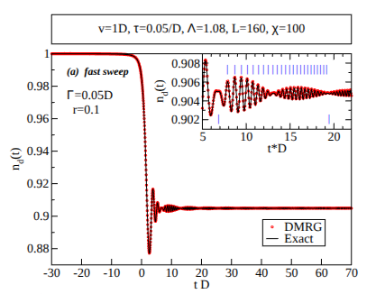

# Snake DMRG (Snake)



Snake is a research code implementing ground-state DMRG and adaptive real-time tDMRG for 1D lattice models and Wilson-chain representations of quantum impurity problems. Model inputs are generated by MATLAB scripts and written as binary files into a `model/` directory; the C++ executable reads `./model/*.dat` and writes results to `results/`.

This repository contains an implementation of the methods and models used in:
- Cheng Guo, *[Using Density Matrix Renormalization Group Method to Study the Real-Time Dynamics of 1D Quantum Systems and Quantum Impurity Systems](https://entron.github.io/assets/2024/master_thesis.pdf)* (Master thesis in Chinese, 2008)
- C. Guo, A. Weichselbaum, S. Kehrein, T. Xiang, J. von Delft, *Density matrix renormalization group study of a quantum impurity model with Landau–Zener time-dependent Hamiltonian*, Phys. Rev. B 79, 115137 (2009)

## Overview

- **Ground states:** “infinite-system” (warmup/growth) DMRG + finite-system sweeps in a fixed good-quantum-number sector.
- **Real-time dynamics:** adaptive tDMRG using a **second-order Suzuki–Trotter** decomposition implemented as a right sweep and left sweep of nearest-neighbor two-site gates.
- **Impurity support:** the first bond (impurity ↔ first bath site) may have a **time-dependent gate** `U_imp(t)` provided step-by-step.
- **Workflow:** generate `model/` with MATLAB → run `Snake` in that folder → analyze `results/` with MATLAB.

The default executable (`cppsrc/snake.cpp`) runs a fixed pipeline: iDMRG → fDMRG → tDMRG. There are no command-line flags; to change the pipeline (e.g. “ground state only”), edit `cppsrc/snake.cpp` and rebuild.

## If you’re new to DMRG (2-minute mental model)

- **DMRG ≈ variational optimization over MPS.** You optimize within the matrix product state (MPS) ansatz.
- **Kept states / bond dimension** $m$ (a.k.a. $\chi$) controls accuracy vs cost.
- **Truncation is controlled by density-matrix eigenvalues.** Snake keeps up to $m$ states and also enforces an eigenvalue cutoff (`Max_Truncate_Error`).
- **“Infinite” vs “finite” DMRG.** Here “iDMRG” means the classic infinite-system warmup (grow the chain); “fDMRG” means sweeps on the finite chain.
- **tDMRG.** Real-time evolution applies local two-site gates and adapts the basis; entanglement growth limits reachable times for fixed $m$.

## Quick start (run the included example)

### 1) Build the `Snake` executable

Dependencies:
- BLAS + LAPACK
- ARPACK
- LAPACK++ (`lapackpp`) headers and library
- C++ compiler (CMake also enables Fortran for typical BLAS/LAPACK/ARPACK link stacks)

Build with CMake:

```bash
mkdir -p build
cd build
cmake ..
cmake --build . -j
```

This produces `build/cppsrc/Snake`.

**LAPACK++ path note:** `cppsrc/CMakeLists.txt` assumes
- headers: `$HOME/usr/include/lapackpp`
- libs: `$HOME/usr/lib`

Adjust `cppsrc/CMakeLists.txt` (or provide symlinks) if your installation differs.

### 2) Generate a run folder (MATLAB)

From the repo root:

```matlab
% gen_model(Omega, omegaratio, Lambda, BathL, z)
gen_model(0.05, 1.0, 2.0, 50, 1);
```

`gen_model.m` creates a folder named like `ratio...Lambda...BathL...z.../` containing:
- `model/` (binary input files)
- `Snake` (copied from `./build/cppsrc/Snake`)

Notes:
- `gen_model.m` uses `system('cp ...')`; it assumes a Unix-like shell (Linux/macOS, or Windows via WSL). Edit that line if needed.
- The shipped generator is an example; for the dissipative Landau–Zener / resonant-level model you typically create your own generator (see “Physics background” and “Input contract”).

### 3) Run Snake

```bash
cd ratio1Lambda2BathL50z1   # name depends on generator parameters
./Snake
```

`Snake` reads inputs from `./model/` relative to your **current working directory**, so you can also run `../../build/cppsrc/Snake` as long as you `cd` into the run folder first.

### 4) Plot results

From the directory containing your run folders:

- `plotsigmaz.m` (time trace from `results/sigmaz_t.dat`)
- `plotspectral.m` (extracts a late-time average from `sigmaz_t.dat` across parameter sweeps)
- `plotvisibility.m` (coherence magnitude from `results/rdm.dat`)

## Physics background

### DMRG (ground state)

Standard DMRG finds an approximation to the ground state of a 1D nearest-neighbor Hamiltonian by optimizing an MPS and truncating using reduced density matrices.

In Snake:
- “iDMRG” (`cppsrc/InfiniteDMRG.*`) is the classic **infinite-system warmup**: grow to the target finite length by repeatedly adding two sites and truncating.
- “fDMRG” (`cppsrc/FiniteDMRG.*`) then performs **finite-system sweeps** to variationally improve the state (default: 1 sweep, hard-coded).

The superblock ground state at each step is computed with **ARPACK** (see `cppsrc/SuperChain_iDMRG.cpp`).

### Adaptive real-time tDMRG

For a nearest-neighbor Hamiltonian $H(t)=\sum_{i} h_{i,i+1}(t)$, real-time evolution over a step $\tau$ is approximated by a symmetric (second-order) Suzuki–Trotter product of two-site gates,
$$U(\tau)\approx\prod_i e^{-i(\tau/2)h_{i,i+1}}\prod_i^{\leftarrow} e^{-i(\tau/2)h_{i,i+1}}.$$

In Snake:
- the MATLAB generator precomputes the **half-step** gates $e^{-i(\tau/2)h_{i,i+1}}$ and writes them to `model/rt_T0.dat`;
- a **time-dependent** half-step gate for the first bond (impurity + first bath site) is provided step-by-step in `model/rt_H1_T0.dat`;
- `cppsrc/SuperChain_tDMRG.cpp` applies these gates in a left→right sweep and a right→left sweep, updating the basis using truncation matrices saved during fDMRG.

The code writes a local observable labelled `sigma_z(t)` each step; for common impurity mappings where the impurity is a two-level system with $n\in\{0,1\}$, one often uses $\sigma_z(t)=1-2n(t)$ and $n(t)=(1-\sigma_z(t))/2$.

### Wilson chain mapping (impurity problems)

Quantum impurity models often couple a local degree of freedom to a continuum bath with bandwidth $2D$. For DMRG, one discretizes the bath and maps it to a 1D chain (“Wilson chain”) with hoppings that decay along the chain; the discretization is controlled by:
- the **logarithmic discretization parameter** $\Lambda>1$ (smaller $\Lambda$ is more accurate but requires longer chains),
- a **$z$-shift** (used for $z$-averaging to reduce discretization artifacts),
- the finite chain length $L$.

This repo contains MATLAB helpers for chain construction:
- `roklogdiscr.m`: logarithmic discretization → star Hamiltonian → chain parameters (Appendix A of Phys. Rev. B 71, 045122 is referenced in the comments)
- `lindiscr.m`: linear discretization + Lanczos tridiagonalization
- `star2tridiag.m`: star → tridiagonal chain transformation

### Dissipative Landau–Zener / resonant-level model (paper context)

The Phys. Rev. B 79, 115137 (2009) study focuses on the (spinless) resonant-level model with a linearly swept impurity level,
$$H(t)=\varepsilon_d(t)d^\dagger d + \sum_k \varepsilon_k c_k^\dagger c_k + V\sum_k (d^\dagger c_k + c_k^\dagger d),\qquad \varepsilon_d(t)=vt,$$
with hybridization width $\Gamma=\pi\rho V^2$ for a flat bath density of states $\rho$ on $[-D,D]$. After discretization and mapping to a Wilson chain, this becomes a nearest-neighbor chain with a local impurity–first-site hybridization and exponentially decaying hoppings.

Under a standard mapping, this model is equivalent to an Ohmic spin-boson model at dissipation strength $\alpha=1/2$, and the impurity occupation $n_d(t)=\langle d^\dagger(t)d(t)\rangle$ is related to a two-level “spin” observable via $\sigma_z(t)=1-2n_d(t)$. The dimensionless sweep parameter
$$r=\frac{2\Gamma}{v}$$
separates fast ($r\ll1$) and slow ($r\gg1$) sweeps.

Snake’s tDMRG engine supports this class of problems as long as you generate the corresponding `model/` inputs (chain, two-site Hamiltonians, and time-dependent impurity gate).

### Finite temperature (FTDMRG) status

Finite-temperature DMRG via purification and imaginary-time evolution is described in the thesis background, and this repo contains experimental/unfinished pieces (`cppsrc/SuperChain_FTDMRG.cpp`, `cppsrc/FiniteTemperatureDMRG.*`). The default `Snake` pipeline does **not** currently expose a complete FTDMRG workflow.

## Implemented models and how to specify them

Snake’s C++ core assumes a **nearest-neighbor chain** built from local operators $a$ (annihilation-like) and $n$ (number/diagonal-like) per site.

From `model/Hfac.dat` it reads per-bond/per-site scalars:
- `hopT(i)` (nearest-neighbor hopping strength on bond $i$)
- `onesiteE(i)` (on-site potential on site $i$)
- `twositesV(i)` (nearest-neighbor interaction on bond $i$)

For real-valued chains, the built-in two-site term is (see `cppsrc/Chain.cpp`):
- hopping: $t\,(c_i^\dagger c_{i+1}+c_{i+1}^\dagger c_i)$ from `hopT`
- interaction (if nonzero): $V\,(n_i-\tfrac12)(n_{i+1}-\tfrac12)$ from `twositesV`
- on-site term on the *newly added* site during growth/sweeps from `onesiteE`

Anything more model-specific (impurity terms, explicitly time-dependent pieces, custom two-site Hamiltonians) is typically injected through the MATLAB-generated matrices:
- `model/HC.dat`: two-site Hamiltonians $H_{i,i+1}$ used as the “middle bond” term during DMRG
- `model/rt_T0.dat`: real-time evolution gates for bonds 2…L−1 (bond 1 is handled separately; see below)
- `model/rt_H1_T0.dat`: real-time evolution gates for bond 1 (impurity + first bath site), one gate per time step

### Included example generator (`gen_model.m`)

`gen_model.m` builds a chain with:
- site 1: a two-level “spin” site (MATLAB stores `sigmax` as the first operator and `sigmaz` as the second)
- sites 2…L: spinless fermion sites (first operator `c`, second operator `n`)

It prepares:
- a biased initial Hamiltonian (large `ed0` field on the impurity) for the ground-state DMRG stage, and
- a driven impurity Hamiltonian during real-time evolution (a term $\Omega\cos(\omega t)\sigma_x$ plus static $\Delta\sigma_z/2$ and density couplings to the first fermion site).

Use it as a template for your own generator when implementing the resonant-level / Landau–Zener sweep (or other impurity models).

## Code structure

C++ (`cppsrc/`):
- `snake.cpp`: hard-coded pipeline iDMRG → fDMRG → tDMRG
- `InfiniteDMRG.*`: infinite-system warmup (growing the chain)
- `FiniteDMRG.*`: finite-system sweeps and handoff to tDMRG
- `AdaptiveTimeDependentDMRG.*`: reads `rt_*.dat` gates and runs time evolution
- `SuperChain.*`: superblock object (wavefunction, bases, truncation matrices)
  - `SuperChain_iDMRG.cpp`: ARPACK ground state solver and middle-bond mappings
  - `SuperChain_tDMRG.cpp`: Suzuki–Trotter time evolution + output
  - `SuperChain_FTDMRG.cpp`: experimental imaginary-time/temperature evolution
- `Chain.*`, `ChainHamiltonian.*`: block growth and Hamiltonian assembly
- `dtmat.*`: reduced density matrix, truncation matrix, von Neumann entropy
- `site.*`: local operators and binary I/O from MATLAB-generated files
- `gqn*.{h,cpp}`, `gqnmat.*`: “good quantum number” bookkeeping and block-sparse matrices
- `public.*`: binary readers/writers and small linear-algebra helpers

MATLAB (repo root):
- `gen_model.m`, `gen_model_multipara.m`: example model generation (creates run folders)
- `savepara.m`, `mat2file.m`, `sitebase2file.m`: binary writers for `model/`
- `lindiscr.m`, `roklogdiscr.m`, `star2tridiag.m`: bath discretization / chain mapping helpers
- `plotsigmaz.m`, `plotspectral.m`, `plotvisibility.m`: plotting scripts for `results/`

## Input: the `model/` directory

`Snake` expects a `model/` directory in the **current working directory** with fixed filenames. `savepara.m` writes them; the C++ code reads them via `cppsrc/public.h` and friends.

- `model/problemparmeters.dat` (note the spelling; Snake expects it exactly)
  - `int32`: chain length `L`
  - `int32`: target good quantum number `TGQN` (a particle-number-like constraint)
- `model/site_base.dat`: local basis + good-quantum-number structure per site (`sitebase2file.m`)
- `model/site_operators.dat`: per-site local operators (`savepara.m`)
  - Snake reads two operators per site: “a” (first) and “n” (second)
- `model/Hfac.dat`: real-valued scalar parameters (`savepara.m`)
  - `hopT` (length `L-1`), `onesiteE` (length `L`), `twositesV` (length `L-1`)
- `model/HC.dat`: two-site Hamiltonians for each bond (`para.h0{i}` in `gen_model.m`)
- `model/rt_T0.dat`: real-time evolution gates for all bonds
  - `int32`: number of time steps `t_num`
  - then `L-1` complex matrices: the half-step two-site gates for each bond
  - note: during evolution Snake uses `rt_H1_T0.dat` for bond 1; `rt_T0.dat` entry #1 is currently ignored (often set to identity), but must still be present for the reader
- `model/rt_H1_T0.dat`: real-time evolution gates for bond 1
  - `t_num` complex matrices: the half-step time-dependent impurity gate per step

Binary format (see `mat2file.m` and the C++ readers):
- integers are `int32`
- real scalars are IEEE-754 doubles (`real*8`)
- matrices are written as: `int32 nrow`, `int32 ncol`, then column-major data
- complex matrices are written as interleaved `(real, imag)` double pairs per element (column-major)

## Outputs

`Snake` creates and overwrites directories on each run:
- `results/`: kept after exit
- `data/`: intermediate blocks; deleted on exit and also cleared at startup

Common output files from tDMRG (`cppsrc/SuperChain_tDMRG.cpp`):
- `results/sigmaz_t.dat`: one value per time step (no explicit time column)
- `results/vonneumannentropy_t.dat`: entanglement entropies during evolution (multiple cuts per step)
- `results/rdm.dat`: reduced-density-matrix coherence element(s), written as columns `Re Im`
- `results/steperror_t.dat`: created but not currently populated

Because time is not written explicitly, you must know the time step $\tau$ and total time from your generator (e.g. `rt_tau`, `t_end` in `gen_model.m`).

## Accuracy and limitations

The main numerical controls are:

- **Kept states / bond dimension** $m$ ($\chi$): default `m_KeptStatesNum = 50` in `cppsrc/dmrg.cpp`.
- **Truncation cutoff:** `Max_Truncate_Error` in `cppsrc/setting.h` (minimum density-matrix eigenvalue kept during truncation).
- **fDMRG sweep count:** `m_sweepTimes` in `cppsrc/FiniteDMRG.cpp`.
- **Real-time Trotter step** $\tau$: set in your MATLAB generator (`rt_tau`); smaller $\tau$ reduces Trotter error but increases cost.
- **Bath discretization and size:** $\Lambda$, $z$, and chain length $L$ (set by your generator). For Wilson chains, $z$-averaging (multiple runs with different `z`) reduces discretization artifacts.

Practical notes:
- Real-time entanglement typically grows with time; long-time dynamics may require increasing $m$ until truncation effects become acceptable.
- Benchmark small systems against exact diagonalization or known limits before trusting large parameter sweeps.
- `Snake` calls `rm -rf results` and `rm -rf data` via `system(...)`; run it only inside a dedicated run folder.

## References and citation

Suggested general DMRG/MPS reference:
- U. Schollwöck, “The density-matrix renormalization group in the age of matrix product states” (Annals of Physics 2011)
- C. Guo "[用密度矩阵重正化群方法研究一维量子系统及量子杂质系统的动力学性质](https://entron.github.io/assets/2024/master_thesis.pdf)" (My master these in Chinese)

If you use this code or build on these ideas, please cite:

```bibtex
@article{PhysRevB.79.115137,
  title = {Density matrix renormalization group study of a quantum impurity model with Landau-Zener time-dependent Hamiltonian},
  author = {Guo, Cheng and Weichselbaum, Andreas and Kehrein, Stefan and Xiang, Tao and von Delft, Jan},
  journal = {Phys. Rev. B},
  volume = {79},
  issue = {11},
  pages = {115137},
  numpages = {6},
  year = {2009},
  month = {Mar},
  publisher = {American Physical Society},
  doi = {10.1103/PhysRevB.79.115137},
  url = {https://link.aps.org/doi/10.1103/PhysRevB.79.115137}
}
```

## Acknowledgements

This program has been developed under the supervision of Prof. Tao Xiang and Prof. Jan von Delft.
Thanks to Shijie Hu, Honggang Luo, Shaojing Qin, Jize Zhao, Hantao Lu, Zhihui Wang and Shuming Li for either direct contribution or discussions during the development of the program.
